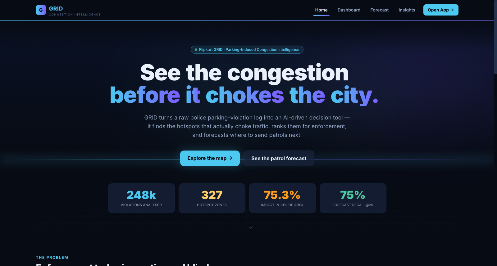
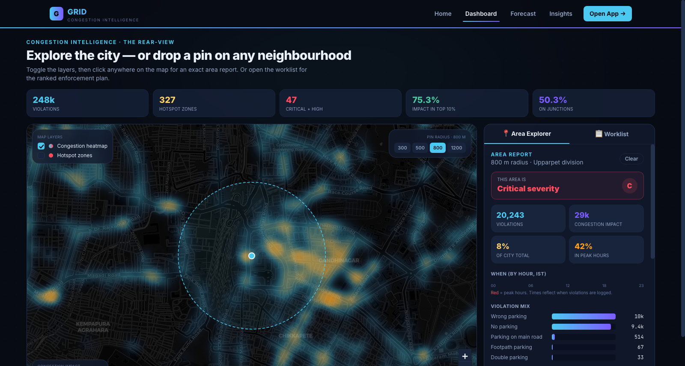

# GRID — Parking-Induced Congestion Intelligence

> **Problem:** *Poor visibility on parking-induced congestion.* On-street illegal
> parking near commercial areas, metro stations and events chokes carriageways and
> intersections. Enforcement today is patrol-based and reactive, there is no heatmap
> of parking violations vs. their congestion impact, and it is hard to prioritise
> enforcement zones.
>
> **This prototype** turns a raw police parking-violation feed into an **AI-driven
> parking-intelligence layer**: it detects illegal-parking hotspots, **quantifies
> each one's impact on traffic flow**, and produces a ranked, map-driven
> **enforcement worklist** so limited patrol resources hit the spots that actually
> choke the city. A **Patrol Forecast** layer then turns the rear-view report into a
> *windshield*: it predicts **where** illegal parking is most likely to recur and
> whether a spot is **heating up**, emitting next week's prioritised patrol roster —
> validated on held-out data (top-20 forecast divisions capture **75%** of the next
> fortnight's violations).




---

## 1. What it does (mapped to the problem statement)

| Problem statement asks for… | How GRID answers it |
|---|---|
| *Detect illegal-parking hotspots* | Spatial gridding (~110 m cells) + **leader/canopy clustering** of high-impact cells into compact, patrollable **hotspot zones**. |
| *Quantify impact on traffic flow* | A **Congestion Impact Score (CIS)** per violation: `severity × vehicle-PCU × time-of-day × junction` — so a bus double-parked on an arterial at a junction during peak hour counts far more than an off-peak two-wheeler. |
| *Heatmap of violations vs. congestion impact* | Interactive Leaflet **heatmap weighted by CIS** (not raw counts), plus a high-impact point layer. |
| *Prioritise enforcement zones* | **Enforcement Priority Score (0–100)** blending impact + persistence + recency, bucketed into Critical / High / Medium / Low tiers with per-zone **recommended actions**. |
| *Move from reactive to targeted* | Quantifies that **~75% of all congestion impact is concentrated in the worst 10% of violation-bearing cells** — the core evidence that targeting beats blanket patrols. |
| *Get ahead of the problem (proactive)* | **Patrol Forecast** — a recency-weighted, trend-aware **risk score (0–100)** per zone + station, turned into a recommended weekly **patrol cadence**. Backtested on unseen weeks; predicts *where* (strong signal), honestly refuses to over-claim *when*. |

---

## 2. Quick start

GRID has two parts: a **Python pipeline** (`src/`) that crunches the data, and a
**React web app** (`web/`) that visualises it.

```bash
#1 clone the repo
git clone https://github.com/Purav001/Parking-Induced-Congestion-Intelligence.git
cd Parking-Induced-Congestion-Intelligence

# 2. run the analytics pipeline (≈6 s on the full ~300k-row file)
python3 -m venv .venv
.venv/bin/pip install pandas numpy scikit-learn
.venv/bin/python src/pipeline.py "jan to may police violation_anonymized791b166.csv"
#   → writes output/*.json AND the web bundle web/public/data/grid.json

# 3. run the web app
cd web
npm install
npm run dev          # → http://localhost:5173
```

The pipeline is the data engine; the React app reads the precomputed
`web/public/data/grid.json` and does no heavy analytics of its own. See
[`web/README.md`](web/README.md) for the front-end details and Vercel deploy steps.

---

## 3. The dataset

`jan to may police violation_anonymized791b166.csv` — **298,450** raw anonymized
police parking-enforcement records for **Bengaluru**. After cleaning (dropping 5
bad timestamps and **50,074 records tagged `rejected`/`duplicate`** so they don't
inflate hotspots), **248,371** records are scored, spanning **2023-11-10 → 2024-04-08**.

Key columns used: `latitude`/`longitude` (100% populated), `violation_type`
(stringified JSON list — a record can carry multiple offences), `vehicle_type`
(22 classes, scooter → HGV/bus), `created_datetime`, `police_station`
(54 divisions), `junction_name` (168 signalised junctions), `validation_status`.

> **Counting note:** numbers below are **per-record by primary (most-severe)
> offence** — the basis the engine actually scores on — and match `output/summary.json`
> and the app. (The raw file also allows multiple offences per record, so a
> per-label tally would be higher: e.g. WRONG PARKING appears on ~165k records.)

What the data shows (see the **City Insights** tab, all post-cleaning):
- Parking offences dominate — **WRONG PARKING (118k)**, **NO PARKING (105k)**,
  **PARKING IN A MAIN ROAD (19k)**, plus footpath / double / near-crossing parking.
- **50.3%** of violations are tagged on signalised junctions; **39%** fall in peak hours.
- **75.3%** of total congestion impact is concentrated in the top 10% of
  violation-bearing cells.
- Violations cluster around the city's known choke points (Majestic / Kempe Gowda,
  Shivajinagar, City Market, Malleshwaram).

---

## 4. Methodology — the Congestion Impact Score

Every weight lives in [`src/weights.py`](src/weights.py) so a traffic engineer can
audit and re-tune the model without touching pipeline logic.

### 4.1 Per-record impact
```
record_impact = severity_w  ×  vehicle_pcu  ×  time_w  ×  junction_w
```

| Factor | Meaning | Examples |
|---|---|---|
| `severity_w` | How much the offence *blocks the carriageway* | Double parking 1.8 · main-road 1.7 · near-crossing 1.6 · footpath 1.4 · wrong-parking 1.2 · no-parking 1.0 · plate/film/fare ≈0.15 |
| `vehicle_pcu` | Road space occupied (IRC Passenger-Car-Unit basis) | Two-wheeler 0.5 · car 1.0 · LCV 1.5 · bus 3.0 · HGV 3.5 |
| `time_w` | Congestion sensitivity of the hour | peak 1.5 · shoulder 1.2 · off-peak 0.8 |
| `junction_w` | On a signalised junction? (intersection capacity loss propagates upstream) | junction 1.4 · mid-block 1.0 |

A record's severity = the **max** over its (possibly multiple) offences; its
primary category = the most severe one.

### 4.2 From points to zones
1. **Grid** every record into ~110 m cells (`GRID_DECIMALS = 3`); a cell's CIS = Σ record_impact.
2. **Hot cells** = cells in the top 10% by CIS.
3. **Leader/canopy clustering**: seed a zone at the highest-CIS unassigned hot cell,
   absorb every unassigned hot cell within 200 m, repeat. This keeps each zone a
   tight, dispatchable disk instead of one chained city-wide blob (the failure mode
   of single-linkage clustering on dense urban data).

### 4.3 Enforcement Priority Score (0–100)
```
priority = 0.55·impact  +  0.30·persistence  +  0.15·recency
```
- **impact** = normalised `log(1+CIS)` — log-compressed because CIS is heavy-tailed
  (one mega-zone would otherwise flatten every other score to ~0).
- **persistence** = distinct active days (chronic vs. one-off).
- **recency** = violations in the last 30 days (is it still live?).

Tiers: **Critical ≥75 · High ≥50 · Medium ≥25 · Low <25.**
Each zone gets an auto-generated, evidence-driven **recommended action** (dedicated
unit vs. rotating beat, which hours, towing for lane-blockers, bollards for footpath
parking, structural fixes for chronic spots).

### 4.4 Patrol Forecast — the proactive layer (`src/forecast.py`)

The worklist is a *rear-view mirror* (where violations piled up). The forecast is the
*windshield*: where to send patrols **next**. It is a deliberately transparent,
**deterministic** historical-frequency model — no training, no black box, instant,
and it never crashes on stage.

**Risk score (0–100), per zone and per station:**
```
risk = minmax(log(1 + recency_weighted_rate)) × (1 + up-to-0.15 if strongly Rising)
```
- **recency weight** halves every **30 days** (a violation 30d old counts half as much
  as today's) — so a heating-up spot outranks one that has cooled off.
- **trend** = recent 21-day count vs. the prior 21 days, only declared when both windows
  carry enough volume. **Rising** nudges the score up; **Cooling** never lowers it (see why below).
- score → **Critical/High/Medium/Low**, mapped to a recommended weekly **cadence**
  (7 / 5 / 3 / 1 visits) — i.e. an operational **patrol roster**, not a vague alert.

**Every parameter was fixed by a hold-out backtest** (train on the early weeks, predict
the final 14 days, measure skill). The pipeline re-runs the **station** and **cell-proxy**
backtests live each run and ships them in `forecast.json`; the UI banner shows the station
result. The zone-level figure below is from a one-off clustering experiment (clustering
inside the live backtest would need re-seeding, so the shipped code reports the raw cell as
its conservative floor — we keep the weakest number visible rather than inflate the headline):

| Unit | Spearman ρ (past→future) | Recall* | Shipped by `backtest()`? | Verdict |
|---|---|---|---|---|
| **Station** | **0.87** | **75%** (top-20) | ✅ `backtest.station` | strongly forecastable |
| **Zone** (≈400 m) | ~0.68 | ~56% (top-50) | one-off experiment | forecastable (the roster unit) |
| Cell (110 m) | 0.42 | 14% (top-20) | ✅ `backtest.cell_proxy` | too sparse alone — conservative floor |

\* share of the next fortnight's actual violations falling in the top-K forecast units.

**What the forecast deliberately does NOT claim — the honesty boundary:**
- **It forecasts WHERE, not the exact WHEN.** `created_datetime` is an enforcement
  *logging* time (≈41% of records are stamped before 07:00, ≈34% before 06:00 — officers
  batch-log, they don't ticket more cars at 3am). So a per-zone "Tuesday 9am" prediction
  would be predicting *paperwork timing*, not congestion. The UI therefore frames every
  **shift window** as a recorded-ticket slot, flags **overnight** ones ⚠ as do-not-deploy
  artifacts, and softly cautions windows inside the documented 02:00–13:00 logging band.
- **Per-zone day-of-week has no skill** (a station's day-mix forecasts no better than
  uniform), so the roster recommends a *cadence*, never a specific weekday.
- **"Rising" is trusted; "Cooling" is shown softly.** Backtest: a flagged rising trend
  persists (~1.56×) but a falling one is ambiguous (~1.0×) — so cooling is never used to
  *stop* patrolling a chronic spot.

Fusing a live traffic-speed feed (Google/HERE/probe, loop detectors, bus-AVL) is the
single upgrade that would convert the timing axis from logging-time to true congestion-time.

---

## 5. Outputs

| File | Contents |
|---|---|
| `output/hotspots.json` | Ranked hotspot zones — the enforcement worklist (priority, CIS, violation/vehicle mix, peak hours, junctions). |
| `output/grid_cells.json` | Every ~110 m cell with CIS — powers the heatmap. |
| `output/summary.json` | City KPIs, impact-concentration curve, violation/vehicle/station/hour distributions, **and the exact weights used**. |
| `output/station_summary.json` | Per-police-division rollups (where to send resources first). |
| `output/records_sample.json` | Top high-impact raw points for the map detail layer. |
| `output/forecast.json` | Patrol Forecast — per-zone & per-station risk score, trend, recommended cadence + shift window, weekly roster summary, and the live backtest metrics. |
| `output/cell_details.json` | Per-cell hour/violation/vehicle breakdowns — powers the pin-drop "analyse any area" feature (exact, since cells partition every violation). |
| `web/public/data/grid.json` | Lean bundle the React app consumes (summary + hotspots + forecast + cells). Written automatically by the pipeline. |

---

## 6. The web app (`web/`)

A polished, animated multi-page site — **Vite + React + TypeScript + Tailwind +
Framer Motion + Leaflet + Recharts**. Four routes:

- **Landing** (`/`) — animated hero, an aurora + perspective-grid backdrop, count-up
  KPIs, and a scroll-revealed "data → decision" journey.
- **Dashboard** (`/dashboard`) — a Leaflet map with independent **layer checkboxes**
  (heatmap / hotspot zones — uncheck both for a clean map), and a tabbed sidebar:
  - **Area Explorer** — click anywhere (or pick a worklist zone) to **drop a pin** and
    get an **exact** area report: severity tier, violations, congestion impact,
    city-share, hour pattern, violation/vehicle mix, hotspot zones inside, **and a
    patrol forecast for that area**. Exact because the ~110 m cells partition every
    violation (their counts sum to the city total).
  - **Worklist** — ranked zones, filterable by tier (Critical → Low); clicking one
    flies the map and opens its Area report.
- **Forecast** (`/forecast`) — a green **validation banner** (live backtest), a weekly
  **roster summary** (patrol visits, Movers, rising zones, tier counts), and a tabbed
  sidebar (**Roster | Report**). Clicking a zone plants a **pin pointer**, sets the map
  title, and opens its full forecast report (risk, cadence, trend, shift window, mix).
- **Insights** (`/insights`) — animated Recharts: impact-concentration, hour pattern,
  and impact-ranked violation / vehicle / division charts.

Routes are code-split (`React.lazy`) so the landing page stays light; the map base
tiles (CartoDB) are the only online dependency. Shareable deep-link for a pinned area:
`/#/dashboard?pin=<lat>,<lon>,<radius>`. Deploy: see [`web/README.md`](web/README.md)
(static build, Vercel-ready).

---

## 7. Honest limitations (prototype scope)

- **Patrol-time bias.** `created_datetime` is when an officer *logged* the ticket, which
  follows patrol shifts (note the 8–11am logging spike; almost no evening records) — it
  is a proxy for, not a direct measure of, when congestion peaks. The time weight encodes
  the *congestion cost* of the clock hour; fusing with real traffic-speed feeds would
  remove the bias. With a trustworthy timestamp the peak window should be re-derived
  empirically rather than assumed.
- **Impact is modelled, not measured.** CIS is a transparent, dimensionless *index* — a
  defensible proxy built from offence type, vehicle footprint, time and junction
  proximity, **not** a calibrated vehicle-delay figure. The natural next step is to fit
  the weights against GPS speed data (Google/HERE/probe), loop detectors or bus-AVL
  travel times. No sensitivity analysis on the four multiplied weights is included yet.
- **Junction flag is metadata, not geometry.** `on_junction` comes from the feed's
  free-text `junction_name` tag, whose coverage varies by division (some report 0%,
  some ~95%). The 1.4× junction multiplier and the "tagged on junctions" KPI therefore
  reflect tagging conventions as much as true junction risk; a production version should
  compute real distance-to-junction from a coordinate layer.
- **Persistence ≈ patrol coverage.** The 30% "distinct active days" term can't fully
  separate a chronically congested spot from one that simply gets patrolled daily —
  the same enforcement-feed bias as the time weight. Treat high persistence as
  "frequently enforced *and* likely chronic", not pure chronicity.
- **Severity & PCU weights are expert estimates** (IRC-aligned) and intentionally
  centralised in `weights.py` for review and tuning.
- **No dwell-time term.** A 10-hour blockage scores like a 2-minute one; the
  `closed_datetime` / `action_taken_timestamp` columns that could supply duration are
  empty in this dataset.
- **No deduplication** of repeat-vehicle records; counts reflect enforcement events.
  Reviewed-`rejected`/`duplicate` tickets *are* filtered out (see §3).

---

## 8. How this would extend to production

1. **Live ingestion** from the enforcement app → rolling daily re-scoring + forecast refresh.
2. **Traffic-feed fusion** to replace modelled impact with measured delay, calibrate the CIS
   weights, and convert the forecast's timing axis from logging-time to true congestion-time.
3. **Forecast horizon & autocorrection** — the deterministic risk model (§4.4) is in place
   and backtested; production would add seasonality and an automatic weekly re-backtest so
   the displayed skill is always current.
4. **Feedback loop** — track CIS / risk in enforced zones over time to *measure* whether
   targeting and proactive patrolling actually reduce congestion.
5. **Event awareness** — overlay metro stations / event calendars to anticipate spillover parking.

---

## 9. Project layout
```
.
├── jan to may police violation_anonymized791b166.csv   # input dataset
├── src/                         # the engine (Python)
│   ├── weights.py      # all tunable scoring + forecast params (the model knobs)
│   ├── pipeline.py     # ETL → scoring → gridding → clustering → forecast → outputs
│   └── forecast.py     # patrol-forecast risk model + hold-out backtest
├── output/             # generated JSON artifacts (hotspots, forecast, cells, summary…)
├── docs/               # screenshots used in this README
├── web/                # the front-end (Vite + React + TS + Tailwind)
│   ├── src/
│   │   ├── lib/        # types · data loader · radius-aggregation · format
│   │   ├── components/ # Nav · GridMap · AreaPanel · ForecastReport · HeroBackdrop · ui
│   │   └── pages/      # Landing · Dashboard · Forecast · Insights
│   ├── public/data/grid.json   # bundle written by the pipeline
│   └── README.md       # front-end + Vercel deploy docs
├── README.md
└── CONTEXT.md          # full project context / reference
```
